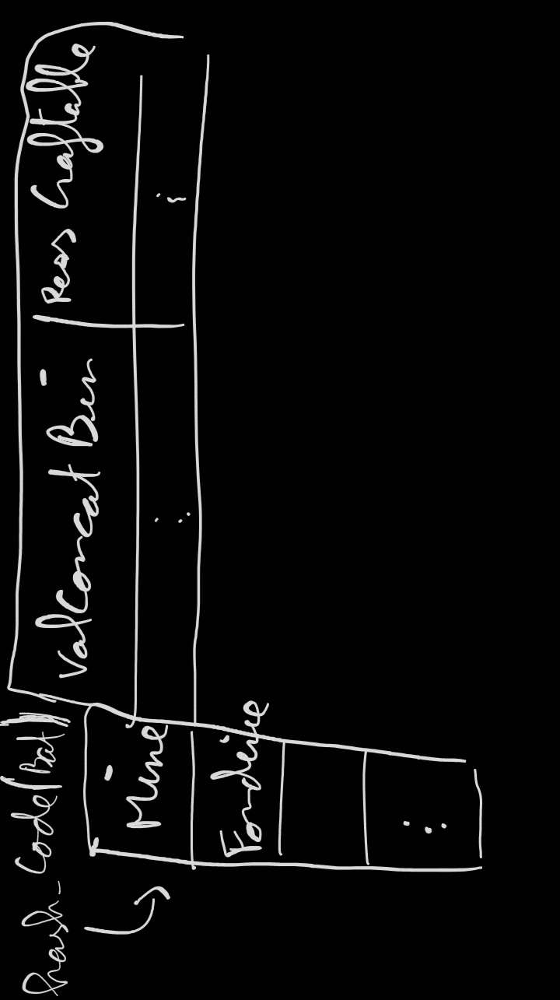
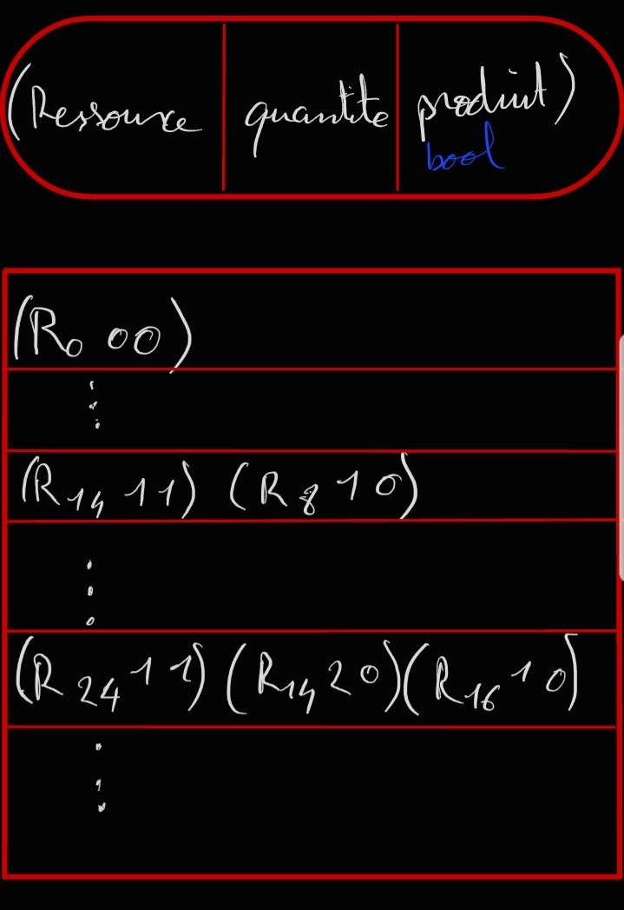

# Craft
> Ce fichier explique comment les crafts sont gérés.

## Craft possible

Pour calculer les crafts possibles à partir de différentes ressources dans un batiments spécifiques, les ressources craftables sont associées à un code unique calculé à l'aide des différentes ressources nécessaires à sa production (sans tenir compte des quantités)  

### Détail du calcul 

Chaque ressources est une **enum class TYPE_RESSOURCE : short**. (2 octets)
Par exemple, dans ce cas on a :
> X Lingot de Fer             => 19 (valeur non réel)
> X Matériaux de construction => 25 (valeur non réel)
> X Puce                      => 35 (valeur non réel)

Pour calculer la ressource craftable avec les 3 ressources disponibles, on calcule le code associé.
> 19 => 0b0001 0011
> 25 => 0b0001 1001
> 35 => 0b0010 0011

On concatène ces 3 valeurs binaires par ordre croissant pour obtenir un long en fais un OU logique à avec un long = 0, en décalant de 16 bit (<< 16 = 2 octets) à chaque fois
> val = 0000 0000 ... 0000 0000 
> val |= 19 => 0000 0000 0001 0011
> val << 16 => 0000 0000 0001 0011 0000 0000 0000 0000
> val |= 25 => 0000 0000 0001 0011 0000 0000 0001 1001
> val << 16 => 0000 0000 0001 0011 0000 0000 0001 1001 0000 0000 0000 0000
> val |= 35 => 0000 0000 0001 0011 0000 0000 0001 1001 0000 0000 0010 0011
> val => dec:81 606 017 059

La valeur de val est unique par sa construction (concaténation binaire par ordre croissant) et est associé à une ressource spéciale.
> val => dec:81 606 017 059 => 45 (valeur non réel) Puce

Cette association de *valeurConcatBin=>Ressource* est décrite dans une structure spéciale.



### Etape de calcul des ressources craftable par batiment

* On récupère le stock d'entrée du batiment
* On trie par ordre croissant/décroissant les ressources
* On élimine les doublons de ressources et les ressources Rien
* On génére toutes les combinaisons avec ses ressources : U Partie{possédant k elt parmi n}
* On génère les valeurs concaténées binaires associés à ses parties/ensembles
* On vérifie quelles valeurs et ressources associées est disponible suivant le type de batiment
* On renvoie l'ensemble des ressources craftables suivant les ressources disponibles

Ensuite le joueur choisira ce qu'il veut crafter dans le batiment, et la Formule complète de craft (ie avec les quantités nécessaires) dans une "matrice creuse"

---
## Formule des crafts

Tout les formules de craft (ie avec les quantités) sont stockées dans une "matrice creuse".  


### Structures code associées : 
```cpp
extern vector<list<FormuleCraft *>> listFormulesCraft;
```

```cpp
typedef struct FormuleCraft
{
    TYPE_RESSOURCE composant;
    uint quantite;
    bool produit;
} FormuleCraft_t;
````
## Stockage des données dans les fichiers

Un fichier *ressource/crafts/cheminFichierCrafts.txt* contient les chemins des fichiers.

> chemin_fichier_**formuleCraft**.txt *(par encore sur)*  
> chemin_fichier_**craftMine**.txt  
> chemin_fichier_**craftFonderie**.txt  
> chemin_fichier_**craftFabrique**.txt  
> chemin_fichier_**craftAtelier**.txt  
> chemin_fichier_**craftCuve**.txt  
> chemin_fichier_**craftChantierSpatial**.txt  

### Possiblités de craft sur les batiments

Un fichier par batiment, organisé comme ci-dessous : 
> *craftBatiment.txt*  
>nombre_de_ressources_craftables  
> valeur_conténer_binaire1 ressource_associée1  
> valeur_conténer_binaire2 ressource_associée2  
> valeur_conténer_binaire3 ressource_associée3  
---
>2   
>81606017059 45  
>45454541332 50  


### Formule craft

Un fichier avec une formule par ligne :
* nb elt dans la formule
* suite de 3-uplets
    * ressource (nombre : short)
    * quantité  (nombre : 0 - 5)
    * produit   (1 -> true, 0 -> false)

> nb_ressources_dispo(nb de lignes)  
> nb_3-uplets 3-uplets  
> nb_3-uplets 3-uplets  
> nb_3-uplets 3-uplets  
> nb_3-uplets 3-uplets  

Format un 3-uplets :
> Ressource quantité produit(bool)  